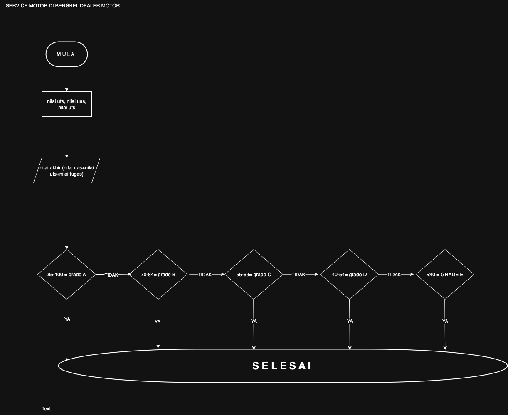

### 1. Algoritma sederhana dan Pseudocode
<pre> ```text Start Input nilai akhir = (0.3 * Tugas) + (0.3 * UTS) + (0.4 * UAS) If nilai akhir >= 85 Print "Grade A" Else If nilai akhir >= 70 Print "Grade B" Else If nilai akhir >= 55 Print "Grade C" Else If nilai akhir >= 40 Print "Grade D" Else If nilai akhir < 40 Print "Grade E" End End If ``` </pre>

### 2. Flowchart

### 3. 4. 5. 